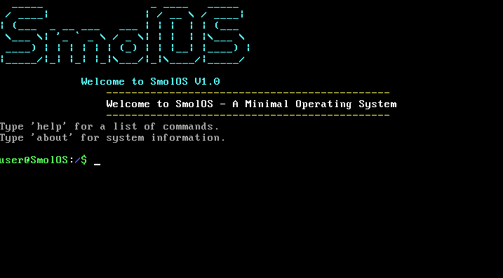
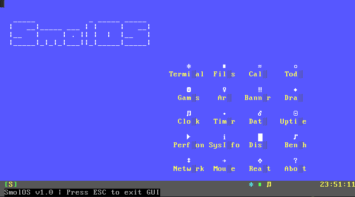
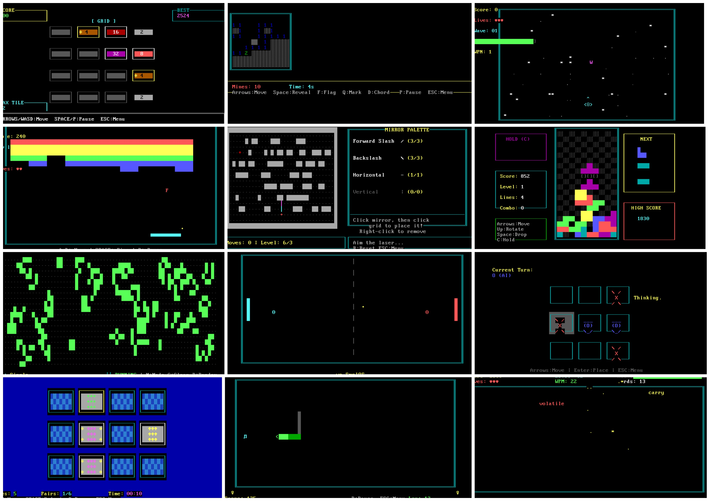

<div align="center">


# SmolOS

**A lightweight, hobby x86 operating system built from scratch in C and x86 Assembly.**

[](LICENSE)
[]()
[]()
[]()

</div>

---

## Overview

SmolOS is a bare-metal, 32-bit x86 operating system written from scratch in C and GNU Assembly. It boots via the Multiboot standard, runs on QEMU, and includes a VGA text-mode shell, a suite of games, GUI applications, hardware drivers, and networking support — all without relying on any external libc or OS services.



---

## Features

### Shell & I/O
- Interactive command-line shell with command history, color themes, and username support
- Scrollable output with a configurable prompt
- Tab completion and command argument parsing

### Drivers
- **Video** : VGA text-mode driver with double buffering, dirty-rect optimization, and a graphics library for boxes, windows, progress bars, animations, and more
- **Input** : PS/2 keyboard (with modifier key tracking, LED control) and PS/2 mouse (with calibration wizard)
- **Timer** : PIT (Programmable Interval Timer) with millisecond/microsecond precision delays and callback support
- **RTC** : Real-Time Clock with alarm, timezone, uptime tracking, and BCD/binary conversion
- **Storage** : ATA/IDE PIO driver + FAT16 filesystem (read, write, delete, directory listing)
- **Audio** : PC speaker driver with note/melody/chord playback, SFX library, WAV parsing, and a playlist system
- **Networking** : Intel E1000 NIC driver, ARP, ICMP ping, UDP send, DNS query, TCP ping
- **PCI** : Full PCI bus enumeration and device browser

### Applications
- **Calculator** : Expression evaluator with scientific functions (sin, cos, tan, log, sqrt, power, factorial) and calculation history
- **File Manager** : TUI file browser with a built-in text editor and file viewer
- **To-Do List** : Prioritized task manager with categories, filters, and timestamps
- **Art Gallery** : Twelve real-time ASCII/ANSI art demos (matrix rain, Mandelbrot, plasma, fire, starfield, DNA helix, radar, metaballs, particles, tunnel, waves, spiral galaxy)
- **Music Player** : Full-featured audio player UI with playlist management, visualizer, EQ, and demo mode
- **GUI Desktop** : Desktop environment with a taskbar, desktop icons, and multiple built-in GUI apps

<br>



### Games
| Game | Description |
|---|---|
| Snake | Classic snake with four difficulty levels and high-score saving |
| Tetris | Full Tetris with ghost piece, hold, next-piece preview |
| Pong | Single-player (vs AI) and two-player modes |
| Breakout | Multi-level breakout with powerups and laser paddle |
| Minesweeper | Beginner / Intermediate / Expert with flagging and chording |
| 2048 | Tile-sliding puzzle with win/lose detection |
| Space Shooter | Scrolling shooter with enemy waves, boss fights, and powerups |
| Tic-Tac-Toe | PvP and PvE (Easy / Medium / Hard minimax AI) |
| Memory Game | Card-matching game with difficulty levels and statistics |
| Mirror Game | Laser-and-mirror puzzle with procedural level generation |
| Type Racer | Falling-words typing game with combo system and WPM tracking |
| Lunar Lander | Physics-based lander with terrain generation and particle FX |
| Life Sim | Conway's Game of Life with interactive drawing tools and patterns |
| Logic Circuit | Gate-placement circuit puzzle game with sandbox mode |

<br>



---

## Project Structure

```
SmolOS/
├── bootloader/          # Multiboot entry point (sos_boot.s) and IDT stubs (sos_idt.s)
├── kernel/              # Kernel entry (sos_kernel.c)
├── drivers/
│   ├── video/           # VGA text driver and graphics library
│   ├── input/           # Keyboard and mouse drivers
│   ├── timer/           # PIT driver
│   ├── rtc/             # Real-time clock driver
│   ├── audio/           # PC speaker / audio driver
│   ├── ata/             # ATA/IDE disk driver
│   ├── fat/             # FAT16 filesystem
│   ├── pci/             # PCI bus driver
│   ├── e1000/           # Intel E1000 NIC driver
│   └── interrupts/      # IDT and IRQ management
├── io/                  # Shell and I/O layer
├── commands/            # Shell command implementations
├── applications/        # GUI apps (calculator, file manager, todo, art gallery, music player, GUI)
├── games/               # All game implementations
├── networking/          # Network stack (ARP, ICMP, UDP, DNS, TCP)
├── libraries/           # Freestanding libc (string, memory, stdio, 64-bit division)
├── include/             # All header files
├── linker/              # Linker script (sos_linker.ld)
└── Makefile
```

---

## Getting Started

### Prerequisites

- `gcc` with 32-bit support (`gcc-multilib` on Debian/Ubuntu)
- `binutils` (`as`, `ld`)
- `qemu-system-i386`
- `qemu-img`

```bash
# Debian / Ubuntu
sudo apt install gcc-multilib binutils qemu-system-x86 qemu-utils
```

### Build

```bash
make
```

This produces `SmolOS.bin`  : A flat Multiboot-compliant kernel binary.

### Run

```bash
make run
```

This will create a 10 MB `disk.img` FAT16 disk image if one does not already exist, then launch QEMU with the kernel, the disk image attached as an IDE drive, and PC speaker audio enabled.

> The QEMU monitor is exposed on stdout. You can type `quit` there to exit.

### Create a fresh disk image manually

```bash
make create-img
```

### Inspect the disk image

```bash
make hexdump-img
```

### Clean build artifacts

```bash
make clean
```

---

## Architecture

SmolOS targets **32-bit x86 (i386)** and boots via the **Multiboot v1** specification. GRUB or QEMU's `-kernel` flag can load it directly.

```
                                            ┌─────────────────────────────────────────────┐
                                            │                  Applications               │
                                            │  Calculator  FileManager  Todo  ArtGallery  │
                                            │  MusicPlayer  GUI  Games (×14)              │
                                            ├─────────────────────────────────────────────┤
                                            │              Shell / Commands               │
                                            │  I/O layer · command dispatch · history     │
                                            ├─────────────────────────────────────────────┤
                                            │                   Drivers                   │
                                            │  VGA · Keyboard · Mouse · PIT · RTC · ATA   │
                                            │  FAT16 · Audio · PCI · E1000 · IDT/IRQ      │
                                            ├─────────────────────────────────────────────┤
                                            │              Freestanding Libraries         │
                                            │  sos_string · sos_memory · sos_stdio        │
                                            │  sos_div64 · sos_stdint · sos_stddef        │
                                            ├─────────────────────────────────────────────┤
                                            │            Kernel (sos_kernel.c)            │
                                            ├─────────────────────────────────────────────┤
                                            │         Bootloader (Multiboot, IDT)         │
                                            └─────────────────────────────────────────────┘
                                                        x86 bare metal / QEMU
```

The kernel is loaded at **1 MiB** (as required by Multiboot). There is no virtual memory or paging — the kernel runs in a flat 32-bit physical address space. An 8 KiB stack is statically allocated in BSS.

Interrupts are handled through a hand-written IDT with separate stubs for the 32 CPU exception vectors (ISR 0–31) and 16 hardware IRQ vectors (IRQ 0–15, mapped to ISR 32–47). C handlers are registered via `irq_install_handler`.

---

## Shell Commands

| Category | Commands |
|---|---|
| Files | `ls`, `cat`, `touch`, `rm` |
| System | `sysinfo`, `hdinfo`, `pitinfo`, `benchmark`, `perfmon`, `diskinfo` |
| Time | `time`, `date`, `datetime`, `uptime`, `clock`, `timer`, `stopwatch`, `countdown`, `sleep`, `reaction`, `setalarm`, `checkalarm`, `timezone` |
| Network | `ping`, `udpsend`, `dns`, `tcpping`, `netinfo` |
| Shell | `echo`, `color`, `rainbow`, `calc`, `history`, `clear`, `username` |
| GUI | `gui`, `musicplayer`, `files` |
| Games | `snake`, `tetris`, `pong`, `breakout`, `minesweeper`, `2048`, `spaceshooter`, `tictactoe`, `memorygame`, `mirrorgame`, `typeracer`, `lunarlander`, `lifesim`, `logiccircuit` |
| Info | `about`, `banner`, `version` |
| Mouse | `mousetest`, `mousedraw`, `calibrate` |
| Help | `help`, `help files`, `help games`, `help gui`, `help network`, `help sys`, `help time` |

---

## License

SmolOS is released under the [MIT License](LICENSE).

---

## Contributing

Contributions, bug reports, and feature suggestions are welcome! Please open an issue or submit a pull request.

